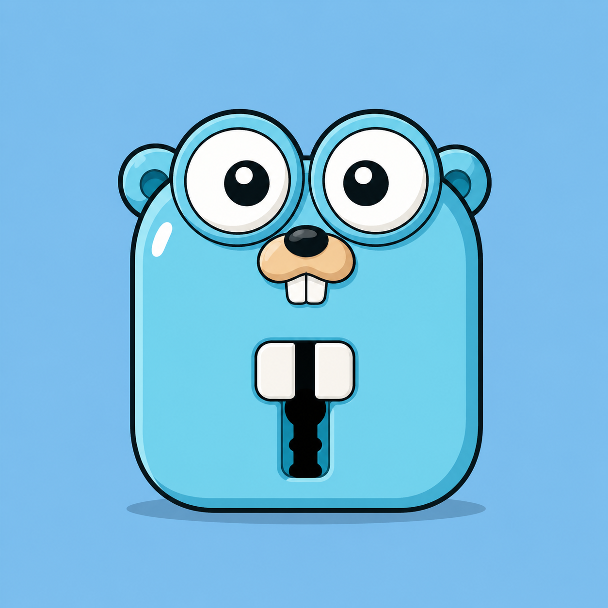

# GOXLOCK

`GoxLock` is a cli encryption tool made compeletly on `golang`. Providing many features that is needed for a powerful encryption




## Installation

Install my project installer via github:
- Installer -> [releases@latest](https://github.com/TOXICAI314/goxlock/releases)
- download whole project -> [project_download](https://github.com/TOXICAI314/goxlock)
    
## Why goxlock?

`goxlock` is a powerful folder encryptor that can encrypt the folder in a custom extension file using AES-GCM . 
The data is stored no where in normal procedure and is secure from all threats .

Only the actual user can access the file because `goxlock` utilizes the os level encryption and base encryption .

`goxlock` never hides , its actually protect the data .
The GCM protection layer makes sure that the data inside is always relevant and user will know if GCM failed during unlocking.

Error hunting is made very simple and robust covering each part of error occurance and dealing with it. 

Error hunt follows these rules:
1. A function must only care about its input and internal data of not being empty or undesired
2. It must not care or protect against uncertain details , its the part of the calling function.

Because of these implementations , the app is easy to understand ,
And the error code dont feels like burden.
Current error codes are ok!. But in next few updates those will be revamped to a better design.
## Quick Start

Header your goxlock experience with a simple check.

1. This given checks whether the base setup is done correctly or not. This checks the function responsible for thee actions.
```shell
goxlock --doctor
```

2. To lock a folder , choose something spare and lock it with following command.
```shell
goxlock --lock -f '<folder>'
```
- This will lock your folder on the same parent dir as the locking folder.

3. To unlock , just get the path of the locked `.g-lock` file and paste it .
```shell
goxlock --unlock -f '<locked_file>'
```
- If you dont want to write just double click on the locked file (you must see a `gopher lock image` on the file display) , it will straight up give you the `cmd.exe` shell.


## Customizing

- You can customize your actions with other provided embeded actions within the application.

- The following will show you how you can do basic customization into the application behaviour.

1. To verify the password , just copy the path of the locked file and do the following .
```shell
goxlock --verify-password -f '<locked_file>'
```

2. To see header details (header are for debugging and seeing the control flow) you shall do the following.
```shell
goxlock --header -f '<locked_folder>'
```

3. To change the password , do the following.
```shell
goxlock --change-password -f '<locked_folder>'
```

4. If you want to delete the file/folder after lock or unlock , you shall do this.
```shell
goxlock --lock -f '<folder>' --del-original
```

5. To change the output of the desired locking and unlocking action , try following.
```shell
goxlock --lock -f '<folder>' --out '<desired_location_path>'
```
- You can provide a absolute path or the local path , both are supported

6. To save what had happened while the run time ,do the following.
```shell
goxlock --lock -f '<folder>' --log
```

7. To make a profile that will given each time you wish to use it.
```shell
goxlock --make-profile --profile-name '<name>' --exlcude "*.txt,*.png"
```
- There are many inbuilt things that you can save into a profile.
Try using them by seeing and understanding them.

```shell
goxlock --use-profile --profile-name '<name>'
```
## Features

- 🔒 AES-GCM encryption
- 🔑 Argon2 password derivation
- 🧂 Random Salt
- 🎲 Random Nonce
- 🛡 Header validation
- 🔍 Password verification without extracting
- 🔄 Change password
- ⏰ Auto relock scheduler
- 🔐 Windows DPAPI session protection (for windows only)
- 📊 Operation statistics
- 📝 Logging system
- 👤 Profiles
- 🩺 Doctor diagnostics
- 🚀 Written entirely in Go
- 🪟 Native Windows support


## Commands

There are vasr number of commands and behaviour you can choose from. Following list will tell the commands in breif.

1. `f` : Telling about the object path (must be absoulte)
2. `lock` : Locks the given folder
3. `del-original` : Deletes the original object
4. `out` : Gives the custom name to the output folder
5. `unlock` : Unlocks the targetted folder
6. `time-out` : time-Shedule re encryption over a certain time (must give minute/hour/day timelimits )
7. `change-password` : Chnages your current password
8. `exclude` : Excludes given patterns
9. `verify-password` : Verify your folder password without unlocking it
10. `header` : Check header data of the encrypted file
11. `log` : Allow logger to log into the hardcoded files
12. `read-log` : Toggle the read log function
13. `stats` : Use it to see the stats of your operation
14. `log-date` : Gives the log date to instructor
15. `checkupdate` : Checks for provided updates from trusted sources
16. `del-profile` : Deletes the named profile
17. `update-profile` : Updates the named profile with the given data
18. `use-profile` : Use the saved profile
19. `make-profile` : Makes the profile of the user as per name
20. `profile-name` : Stores the name of the profile
## Security

Safety is the only thing that `goxlock` targets . No password or secret is revealed in any file. The password is never stored in raw string or readable format (only for scheduling the password ecrypted form is stored after that it is destroyed).

- NOTE
    - The User must know that the password is note stored in any kind of format normally.
    - So if the you forget the password its your concern.
    - Normally the app will not let it happen because it is built with password integrity checks on lock and end password showing.
    - There is no option for `Forget Password`
    - This app is only made for encryption purpose not for protection purpose , if you lost your file or someone altered your file bytes or deleted it , its upon you.
    - `goxlock` can only protect from data not being shown up. Rest steps need to be taken by your side.
    - Schedule tasks when you need it otherwise normally unlock.

## Security Features
- No actual file will be deleted unless the data is totally written . If anything corrupts you can just remove the resedue the corruption left.

- The Schedulling is done under the prtection of DPAPI (windows) which is an OS level of protection given to per User.

- The Overwrite is protected via the mutex made withing the OS.

- The header is checked before unlocking to let the application be sure that is the file format to unlock.

- Password hider is inbuilt from the buffer of the terminal.

- The things that it can do for users saefty ->

    Protect Against       |             Status 
    -------------------------------------------
    Lost USB              |             ✅

    Stolen encrypted file |             ✅

    File tampering        |             ✅

    Same Windows user malware during active DPAPI session | ⚠️ Limited

    Kernel-level attacker |             ❌ (sessions)

- Over all the data is never revealed on its base form and you will feel secure even in attacks.


## Scheduling

One of the best feature of `goxlock` is scheduling a task. Tough it requires the password to be stored in a encrypted format , it has its own pros.

The user can schedule the locking again after unlocking , this is done via `task scheduler` (for windows)

- NOTE
    - If the current user is compromised or the device is open as the current user , the data is not safe.
    - Hence , use it when you are confrimed that no one will peak out.

## Architecture
- Locking
``` text
User

↓

Argon2

↓

AES Key

↓

Encrypt

↓

.g-lock
```

- Unlocking
```text
Password

↓

Argon2

↓

Verify

↓

Decrypt
```
## Limitations

There are still some known limitations for this app which will be solced in the future.

1. Windows only
2. Less understandable to non cli users
3. Non UI interface
## Contribution

Thanks to everyone who has contributed to GoXLock ❤️

    Name            |          Badge
    TOXICAI314              (🌿 Owner)

- Every Contributor is most welcomed by me 😁.
- For contributing to the project you can see -> [Contributing](CONTRIBUTING.md)

## Licence

This project uses the following License, check that out for more details.

[LICENCE](LICENCE)
## Acknowledgements

- GOLang & module developers : For providing such an easy and robust language to work upon and easy modules to pass by.

- Windows API : For making the system integration possible

- Inno Setup : For making the application better on the installation side


## Design Philosophy

Golang simpley folows these rules on the out face of it.

1. Security first

2. Simple commands

3. Transparent behaviour

4. No hidden network communication

5. No cloud dependency

According to `goxlock` no private info must go out the boundaries of the user hardware. No data can be seen other.
The user must feel secure of what they got for the privacy.

BECAUSE ASSURANCE COMES FROM TRUST.
## Roadmap

The next update details will be discussed here:

```text
v1.1 - The Linux Update

- Adding binary support for the linux
```

To see the Changelogs go here -> [Changelogs](CHANGELOG.md)

## Promises

TOXICAI314 promises that:

- The app will never have ADs or any kind of subscription. Its free to use and distribute

- No data will leave your computer , it will stay where it is.

- No AI integration will be made for this.

- No Telemetry will be done on the user , Never even in asked or intentional.

- No Login or Account system will be made , Its free for all.

